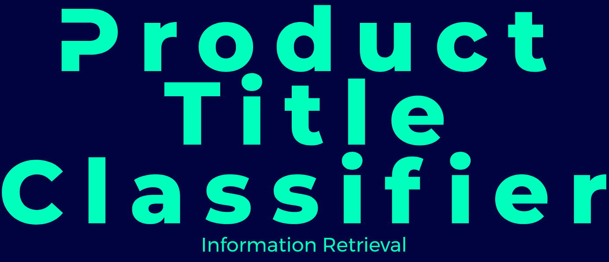

# Product Title Classification

This is an implementation for the CIKM AnalytiCup 2017, around the topic of "Product Title Quality". The goal is to take SKUs and rank its title's clarity and conciseness. Referenced papers are attached to this repository. And as such, the aim is to craft ensemble models that either try to replicate results or find new methods for classification.

This was initially made as a semester project for **Information Retrieval - CS317** at FAST NUCES, Karachi.

See the documents in the *assets/pdf* for more information.

## Reference

- [StackOverflow, Extracting Nested Items With BeautifulSoup](https://stackoverflow.com/questions/20336112/extracting-nested-items-with-beautifulsoup)
- [Mediu, Engineering Upside - A Beginner’s Guide to Optimizing Pandas Code for Speed](https://engineering.upside.com/a-beginners-guide-to-optimizing-pandas-code-for-speed-c09ef2c6a4d6)
- [Kavita Ganesan - How to Use Tfidftransformer & Tfidfvectorizer?](https://kavita-ganesan.com/tfidftransformer-tfidfvectorizer-usage-differences/#.YKDjxXUzZhE)
- [Text Analysis & Feature Engineering with NLP](https://towardsdatascience.com/text-analysis-feature-engineering-with-nlp-502d6ea9225d)
- [GitHub, Text Analysis & Feature Engineering with NLP](https://github.com/mdipietro09/DataScience_ArtificialIntelligence_Utils/blob/master/natural_language_processing/example_text_classification.ipynb)
- [Spacy V3, Features](https://spacy.io/usage/v3?#features)
- [AutoNLP](https://huggingface.co/autonlp)
